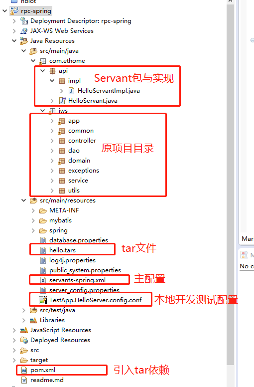

一个整合springframework的rpc服务实现，基于tars平台。演示的RPC实现中，可调用常用的数据库操作、REDIS缓存等操作。其它 插件的扩展通过mvn的pom.xml引入。

这个DEMO是我从现有的项目中提取出来的，因为想尝试以后用RPC的方式来提供服务，所以才有此DEMO的整合。个人翻阅官方的各类文档，都是一些零起步的示例，
不太有这种现成的整合资料，都以特贡献出来，为想尝试类似于我这种改造类场景的小伙伴少走一些弯路吧。


# 包目录说明



# 改造方式
1. 定义api包，即Servant及实现所在的目录
2. 整合原spring.xml文件，形成servants-spring.xml（可参照我源码整合后的文件）
3. pom.xml引入tar依赖


# 引入TAR包
打开根目录下的pom.xml文件，添加tar依赖
```
<dependency>
	<groupId>com.tencent.tars</groupId>
	<artifactId>tars-core</artifactId>
	<version>1.6.1</version>
</dependency>

<dependency>
	<groupId>com.tencent.tars</groupId>
	<artifactId>tars-spring</artifactId>
	<version>1.6.1</version>
</dependency>
```

# 本地运行
eclipse右键debug  -> configurations -> 添加java application的运行主类:

1. 选择你的工程，添加运行主类
```
com.qq.tars.server.startup.Main 
``` 
2. 添加JVM本地运行的配置参数文件
```
-Dconfig="E:\work\research\tars\java\rpc-spring\src\main\resources\TestApp.HelloServer.config.conf" //换成你的conf文件路径
```

3. 其它的一些配置

常用资源的配置在 `$/src/main/resource`下
- 数据库配置
打开 `database.properites`, 配置你自己的MYSQL

- REDIS配置
打开`server_config.properties` 配置redis端口及IP


ps: 原来此项目是通过web.xml来加载spring.xml文件，现在这个web.xml可以不要，部署到tars平台后，由平台的机制来加载。


*有喜欢的小伙伴，点个star吧。*


